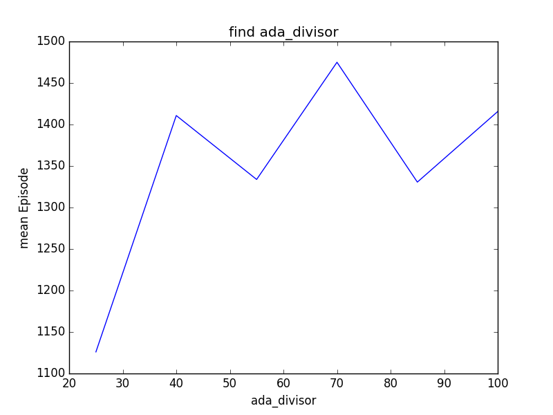
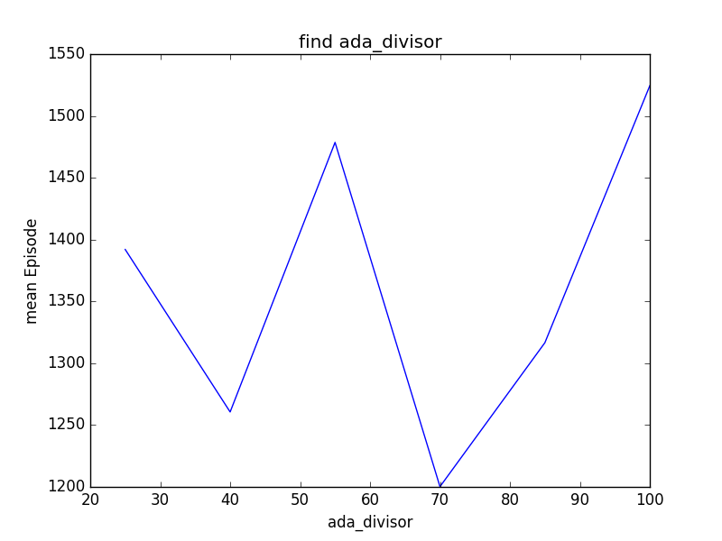
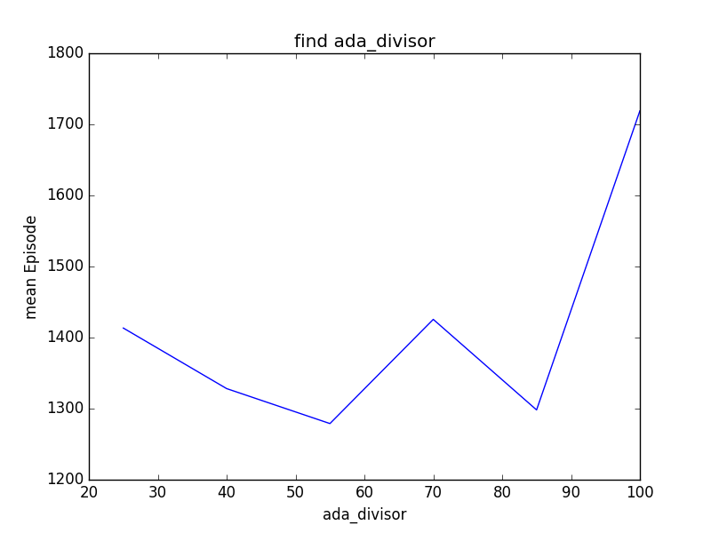
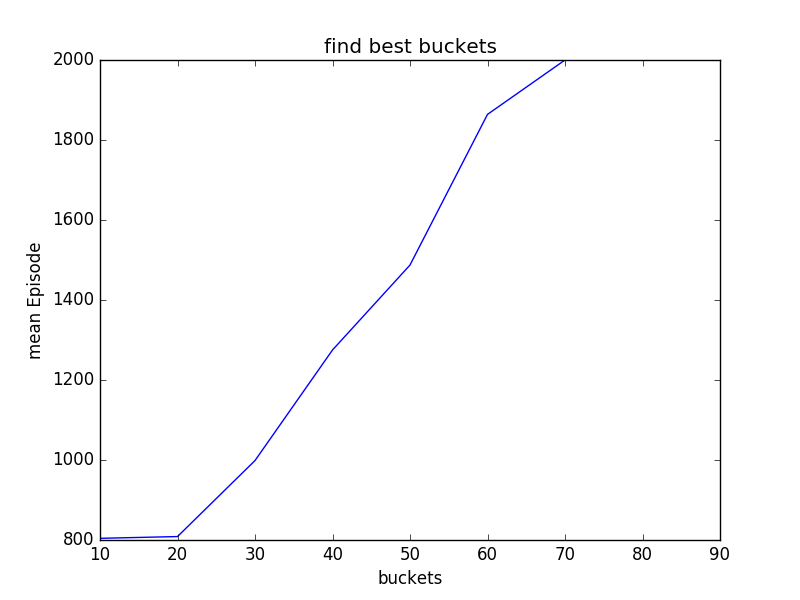
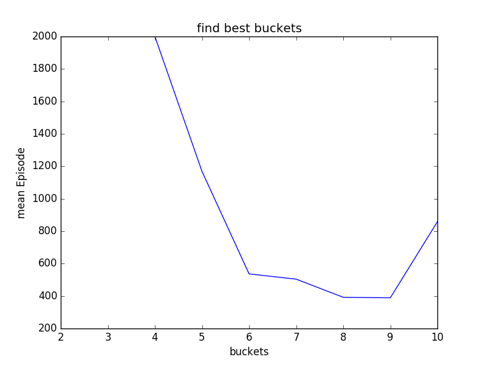

# Q_MountainCar
Mountain Car Training using Q-learning 

Author: Tianrui Guan, Yexin Wu, Phuong Minh Nguyen 

Code based on the environment from [OpenAI Gym](https://gym.openai.com/envs/MountainCar-v0/).

## Introduction
	
In this project, we decide to choose a training model from classic control and explore with a relatively complicated behavior and a hard-to-get goal. First we will talk about some background information about Q-learning. Second, we will compare the effectiveness of learning with different starting points and find a good hyperparameters to start our learning. Then we will show the data we collect and analyze the reason behind the data. Finally we will make some conclusions for the difference between cartpole and mountain car with Q-learning. 

## Background information

To understand our project, basic understanding of q-learning is required, which is a reinforcement learning technique used in machine learning. Given a set of hyperparameters, the q-learning will get experience from episodes and update the state reward and build up towards (or converges to) an optimal policy. This technique doesn’t requirement a model of an environment, and just learn from episodes. The Q-Learning algorithm can be described as the following steps:

1. Initialize the Values table Q(s, a), or a matrix Q.
2. Choose current state s (can be chosen randomly)
3. Choose an action a for the next state greedily based on Q Values in table
4. Take the action, and observe the reward r as well as the new state s’
5. Update the Value for the state using the observed reward and the maximum reward possible for the next state: Q(state, action) = R(state, action) + Gamma * Max[Q(s’, a)] for all actions a
6. Set the current state to the new state, and repeat the process until a terminal state is reached.

Also there are some hyperparameters:

*	Buckets: Usually our observations are values belongs to an interval, in order to divide those continuous value into discrete states, we need a bucket variable to group a set of values in one states. This hyperparameter is related to the number of states.

*	Epsilon: Represent exploration rate. Usually we will design an epsilon decreasing curve and set a min_epsilon value so that after some points, the exploration rate will stay at that lower bound. 

*	Alpha:  Represent learning rate. Similar as Epsilon, we will also design an alpha curve and set up a min_alpha.

*	Ada_divisor: A variable that can help us adjust the slope of epsilon and alpha curve. 

*	Gamma(discount factor): A variable that specify we value immediate reward more or future reward more. A high discount factor values future reward more, while a low discount factor values immediate reward more. But we will not discuss much about this parameter.

## Result and Discussion

In our experiment, we will compare our learning by changing the following factors: min_epsilon for exploration rate, min_alpha for learning rate, ada_divisor for adjusting epsilon and alpha curve, and finally, buckets for number of states. For each of those hyperparameters, we will first set up a few numbers that is widely spread among the domain of it, then get a general idea of which interval the best performance will be likely to occur. Then we will run a script that will go through that range step by step and compare the average performance to get a good hyperparameter. Our initial hyperparameters are set as following:

	
                                      min_epsilon=0.1

                                       min_alpha=0.3

                                       ada_divisor=25

                                      buckets=(40, 40,)

### Min_epsilon and Min_alpha

We play around our code and set min_epsilon, we realize that the higher lower bound we set, the worse the performance will be. So we test our result from 0 to 0.3 and take 0.03 a step, then iterate each step five times to plotted the graph.

As we can see, the mean episode for learning will be minimized when epsilon = 0. The result is not surprising because for a simple problem like this, there is not much variance for the environment and no need for exploration as long as we get the job done. As a result, we got the best average performance when we set min_epsilon to 0. 

Using the similar idea for min_alpha, we test our result from 0.3 to 0.9 and take 0.1 a step, then iterate each step five times to plotted the graph. We got the best average performance when we set min_alpha to 0.6. It’s very interesting how it performs well when alpha is around 0.4 and 0.6. But I wouldn’t double too much about this finding because it’s close to the golden ratio. Starting from some point, we will keep learning at the rate of 0.6. 

 
### Ada_divisor

We discover that sometimes, setting a lower bound for learning and exploration rate is not that much critical to how fast we learn so that we can reach our goal. We believe choosing a right slope for epsilon and alpha curve can play a greater role in improving our learning. So similarly, we choose to test the result from 25 to 100 and take 15 a step, then iterate each step five times to plotted the graph. Unfortunately, we did three different experiments and the results appears to be random. Therefore we cannot conclude much about how ada_divisor will affect q-learning from this particular example and method. The following are the results from three different experiments: 

  
   
  

### Buckets

The number of buckets determines how many states we will have. Intuitively, the more states you have, the more precisely you will learn. But if you have only few states, you might not even be able to learn. For a simple model like this, we would like to discuss how we should set our buckets so that the we will learn quicker. Also we want to minimize the number of states because it is intuitive that after some point, it might not be necessary for us to divide the bucket further, and the performance will resemble. Yet our result show it differently. To simplify the process, we set the two buckets variable in this form: buckets=(x, x,) for some x. We will set x to be from 10 to 90 with a step of 10, repeating five times to get the average for each steps, given the chance of 2000 episodes.

From this graph, we learn that it gets worse when we divide our buckets further. When x = 70, 80 and 90, we will not even solve the problem before 2000 episodes. This results correct our previous thoughts and it means that as we have over-numbered states, we manually complicate the problem and as a result, we need more episodes to gradually reach every states and update the state reward, or our experience. This takes us further to see what is the minimal numbers of states required for mountain car to learn and solve this problem. We adjust our buckets, or x from 2 to 10, and have the following result:

It is not hard to see that we get the best performance at around buckets = 8 by 8 and 9 by 9.

## Conclusion

In general, we need more episodes to solve mountain car problem than cartpole. After experimenting, we have some intuition of why mountain car needs more episodes. We need to blindly explore before we have an positive reward(reach the top) to know that we are doing right. The expenses for getting to the top for the first time is high. The more we have some positive feedback, the better we learn. 

After finding the best hyperparameters, we can conclude that, firstly for simple problems with relatively robust environment, we don’t need to keep explore the environment much once we get the job done. Second, even though we did not strictly test at what rate we should learn after we reach some episodes, but around 0.6 or 0.4 could be a good starting point if you have absolutely no idea which number you should pick. Third, we realize we cannot conclude much about ada-divisor from our methods because it appears the performance varies for each experiments. Lastly, we learn that for this particular problem, the best number of buckets is 9 by 9. 
